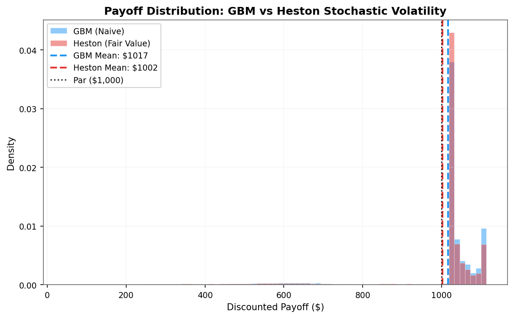
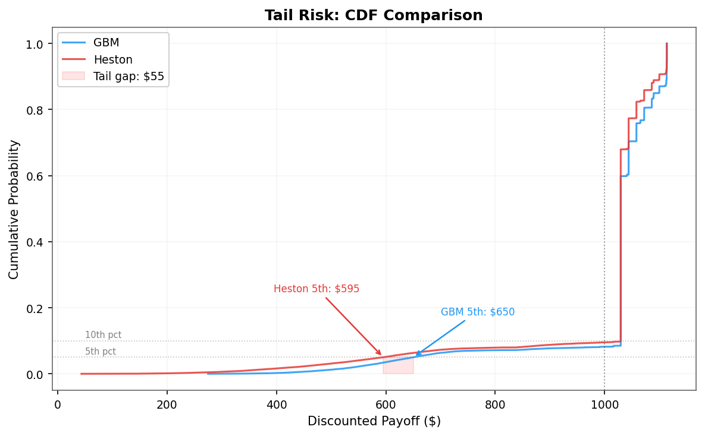
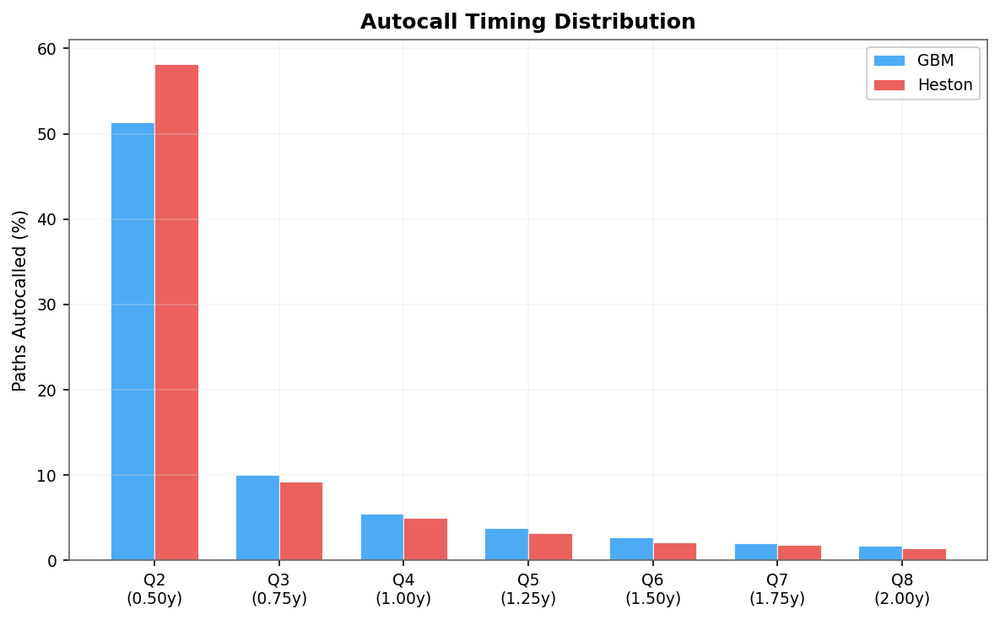
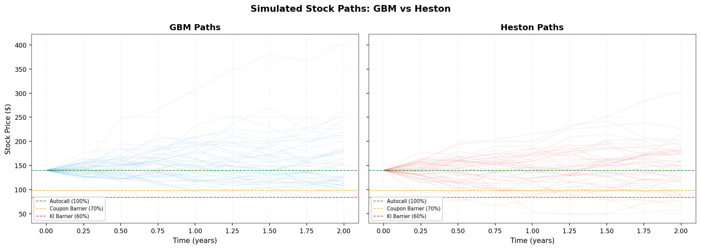
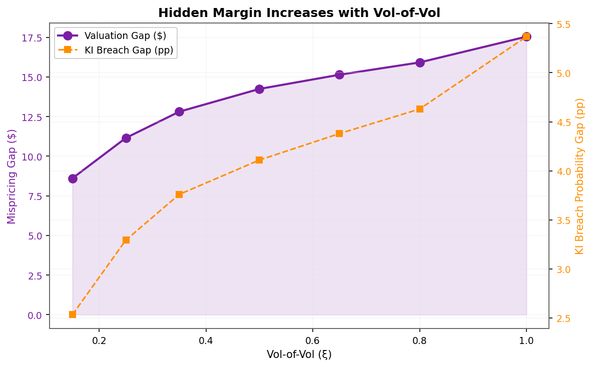
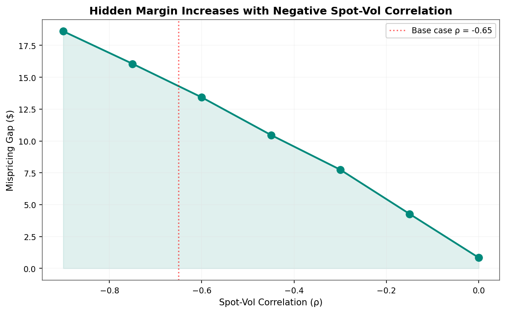
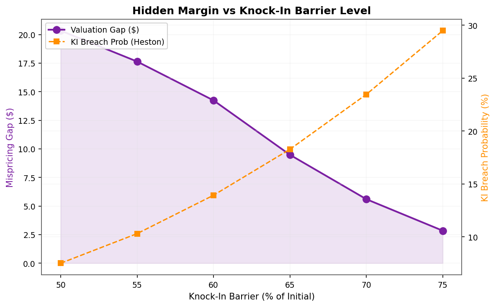

# The Autocall Trap

**Mispricing of Path-Dependent Barrier Notes in Retail Structured Products**

A quantitative framework for detecting embedded margin in retail autocallable contingent income barrier notes with memory coupon, using competing Monte Carlo pricing engines (GBM vs. Heston stochastic volatility).

---

## Overview

Retail autocallable notes are among the fastest-growing structured products, yet their pricing remains opaque to investors. This project demonstrates that **standard flat-volatility models systematically understate the risk embedded in these notes**, creating a hidden margin that benefits issuers at the expense of retail buyers.

The framework prices an ORCL-linked Autocallable Contingent Income Barrier Note with Memory Coupon using two competing Monte Carlo engines:

1. **GBM (Geometric Brownian Motion)** — the naive benchmark that a retail investor or basic textbook would use
2. **Heston Stochastic Volatility** — a more realistic model capturing vol smile, mean-reversion, and leverage effect

### Key Finding

> The Heston model reveals a **hidden margin of ~1.4% ($14.24 per $1,000 note)** invisible to investors using flat-vol models. The mispricing **widens during market stress** — exactly when investor protection matters most.

---

## Results

### Payoff Distribution

The Heston model produces fatter left tails, meaning catastrophic losses are more likely than GBM suggests:



### Tail Risk

The 5th percentile payoff drops from **$650 (GBM) to $595 (Heston)** — a $55 gap in worst-case outcomes:



### Autocall Timing

Most paths autocall at Q2 (6 months). The Heston model shows slightly higher early autocall rates but materially worse outcomes for paths that survive:



### Sample Paths: GBM vs Heston

Note the vol clustering visible in Heston paths — periods of calm followed by bursts of volatility:



---

## Sensitivity Analysis

### Vol-of-Vol (ξ) — The Primary Driver

The mispricing gap monotonically increases with vol-of-vol. At ξ = 1.0, the hidden margin reaches ~$18:



### Spot-Vol Correlation (ρ) — The Leverage Effect

More negative correlation (stronger leverage effect) widens the gap. At ρ = -0.90, hidden margin reaches ~$18:



### Knock-In Barrier Level

Higher barriers amplify the mispricing because more paths breach under stochastic vol:



---

## Project Architecture

```
autocall-trap/
├── src/                          # Core library
│   ├── __init__.py
│   ├── note.py                   # Term sheet specification
│   ├── engines.py                # GBM & Heston Monte Carlo engines
│   ├── pricer.py                 # Payoff engine & pricing result
│   ├── sensitivity.py            # Regime sensitivity sweeps
│   └── visualizations.py         # Publication-quality figure generation
├── tests/                        # Unit tests
│   └── test_core.py
├── figures/                      # Generated figures (PNG + PDF)
├── report/                       # LaTeX paper
│   └── paper.tex
├── main.py                       # Run complete analysis
├── requirements.txt
├── LICENSE
└── README.md
```

---

## Quick Start

### Installation

```bash
git clone https://github.com/your-username/autocall-trap.git
cd autocall-trap
pip install -r requirements.txt
```

### Run Analysis

```bash
# Full analysis (200k paths, ~30 seconds)
python main.py

# Quick run (50k paths, ~10 seconds)
python main.py --quick

# Custom path count
python main.py --paths 500000
```

### Run Tests

```bash
python tests/test_core.py
```

### Compile LaTeX Report

```bash
cd report
pdflatex paper.tex
pdflatex paper.tex  # Run twice for references
```

---

## Term Sheet (Test Case)

| Parameter | Value |
|-----------|-------|
| Underlying | ORCL (Oracle Corp) |
| Initial Price | $140.00 |
| Maturity | 2 years (8 quarterly observations) |
| Coupon | 2.625% per quarter (10.5% p.a.) |
| Memory Coupon | Yes |
| Autocall Trigger | 100% of initial |
| Coupon Barrier | 70% of initial ($98.00) |
| Knock-In Barrier | 60% of initial ($84.00) |
| First Autocall | Observation 2 (6 months) |

## Heston Calibration

| Parameter | Symbol | Value | Interpretation |
|-----------|--------|-------|----------------|
| Initial variance | v₀ | 0.065 | ~25.5% implied vol |
| Mean-reversion speed | κ | 2.0 | Moderate |
| Long-run variance | θ | 0.07 | ~26.5% long-run vol |
| Vol-of-vol | ξ | 0.50 | Significant |
| Spot-vol correlation | ρ | −0.65 | Strong leverage effect |
| Feller ratio | 2κθ/ξ² | 1.12 | Satisfied |

---

## Methodology

### GBM (Benchmark)
$$dS = rS\,dt + \sigma S\,dW$$

### Heston (Fair Value)
$$dS = rS\,dt + \sqrt{v}S\,dW_S$$
$$dv = \kappa(\theta - v)\,dt + \xi\sqrt{v}\,dW_v$$
$$\text{corr}(dW_S, dW_v) = \rho$$

The Heston model uses a truncated Euler discretization with 20 substeps between each quarterly observation date for accuracy.

---

## License

MIT License — see [LICENSE](LICENSE) for details.

## Citation

If you use this work in academic research, please cite:

```
@misc{autocall-trap-2026,
  author = {Sid},
  title = {The Autocall Trap: Mispricing of Path-Dependent Barrier Notes in Retail Structured Products},
  year = {2026},
  url = {https://github.com/your-username/autocall-trap}
}
```
